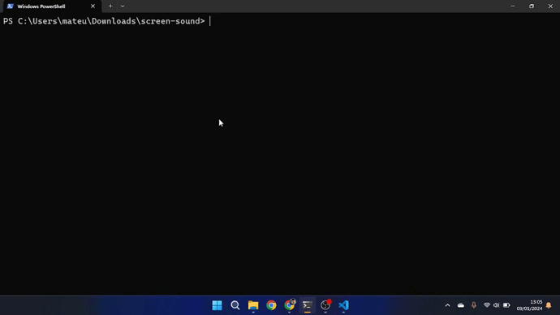

# Screen Sound

## About

Development of a backend application called ScreenSound, completely object-oriented, where a dictionary was created that includes a text for the band name and a list of integers, for notes that will be added by the user.

We basically have many functionalities, following the functionality of a small backend application, we have actions such as listing, adding, and assigning values declared in sequence.

1. Add bands.
2. List bands
3. Add notes to bands
4. Show band notes

## Layout



## How to execute the project?

```bash
# Terminal

git clone https://gitlab.com/mateusdev3400/screen-sound
git clone https://github.com/mateusdev3400/screen-sound

cd screen-sound/

dotnet build

dotnet run
```

## Technologies

The following tools were used in the construction of the project:

### Frontend

- Csharp (C#)

## Contributors

<table>
    <thead>
        <tr>
            <td>
                
            </td>
        </tr>
    </thead>
    <tbody>
        <tr>
            <th>Mateus Maciel</th>
        </tr>
    </tbody>
</table>

### How to contribute

- Fork the project.
- Create a new branch with your changes: ```bash git checkout -b my-feature```
- Save the changes and create a confirmation message telling you what you did: ```git commit -m "modified file"```
- Submit your changes: ```git push origin my-feature```

## Licença

This project is licensed under the Alura Cursos license.